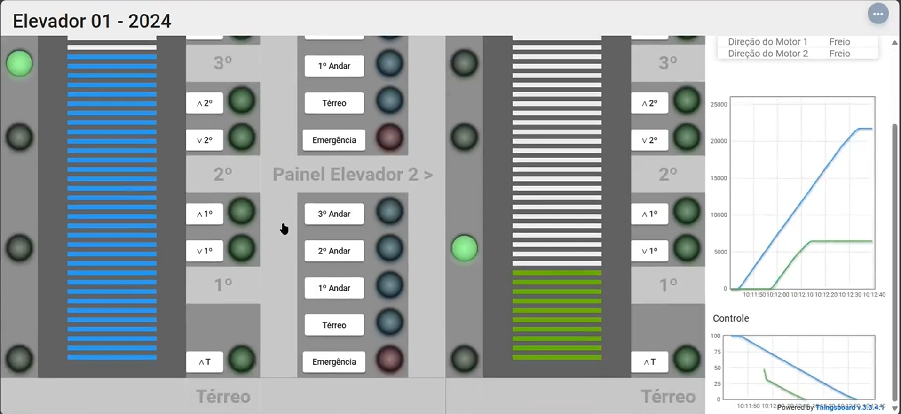

# FSE 2024.1 - Trabalho 2

## Elevadores

## Sobre o projeto

O trabalho foi feito inteiramente na linguagem Rust e foi testado em uma raspberry pi com o sistema linux. Para executa-lo, é necessário instalar o ambiente de desenvolvimento Rust, compilar o projeto (normalmente com o comando `cargo build`) e executar o binário gerado na pasta `target`.

## Pré-requisitos para a compilação

- Rustup (rustc, cargo, etc) instalado e configurado no PATH (https://www.rust-lang.org/tools/install)
    - Sempre necessário para compilar o projeto
- Cross (https://github.com/cross-rs/cross)
  - É necessário para fazer cross-compilação para a raspberry pi, caso não deseje compilar diretamente no target (recomendado)
  - Docker (https://docs.docker.com/get-docker/)
    - Pré-requisito para o cross

## Como compilar

### Compilando diretamente no target

1. envie o repositório para a raspberry pi
2. execute o comando `cargo build --release` na pasta do projeto.
3. o binário estará na pasta `target/release`, basta executar.

### Cross-compilando (recomendado)

1. execute o comando `cross build --release --target armv7-unknown-linux-musleabihf` na pasta do projeto.

2. o binário estará na pasta target/armv7-unknown-linux-musleabihf/release, envie o binário para a raspberry pi da forma que preferir, scp por exemplo.

3. execute o binário correspondente na raspberry pi.

> **IMPORTANTE**: Para executar o binário na raspberry pi, é necessário que o binário tenha permissão de execução. Caso não tenha, execute o comando `chmod 744 <nome_do_binario>`.

## Vídeos de demonstração
- Demonstração da compilação e das funcionalidades: (https://youtu.be/1Ppof8FnLjc)

## Experimento

Enviando elevador 1 para o andar 3 e elevador 2 para o andar 1.

